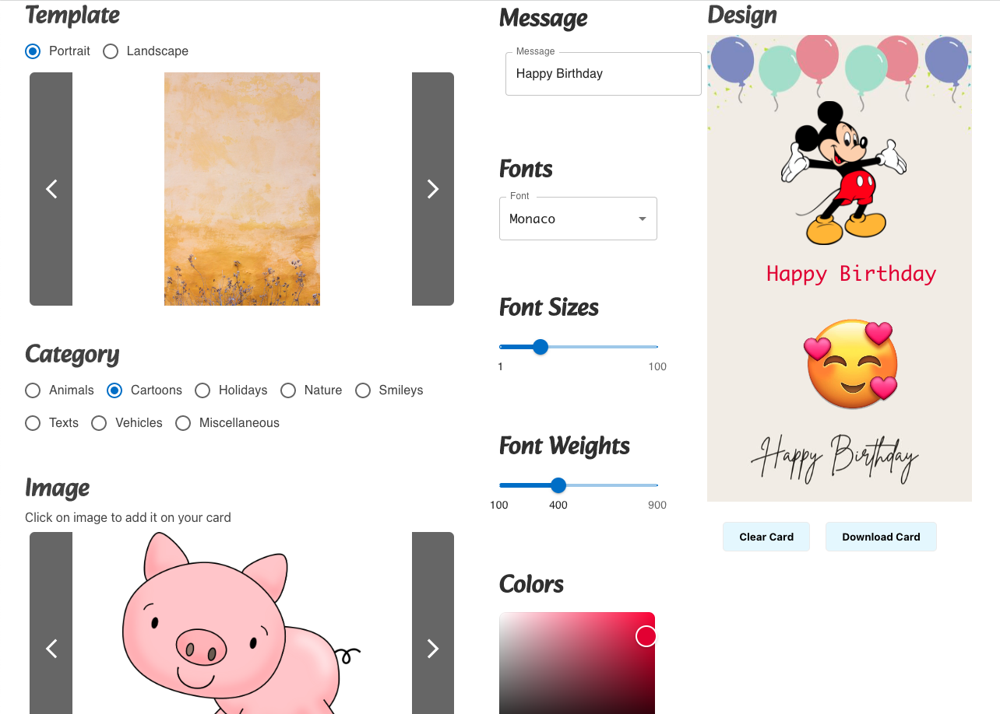

# Create a card

## An application allows to design and downlod a custom greeting card

### Site is live at <https://loquacious-treacle-8f6c4c.netlify.app>

Create a Card is a versatile and user-friendly application that enables its users to design and share custom-made greeting cards. With its wide range of features, users can personalize every aspect of their card, including its orientation, template, category, images, and message. Additionally, the app offers customization options such as font, font size, and color to create a truly unique and memorable greeting card. Once designed, the card can be downloaded and shared with loved ones, making it a perfect choice for any occasion.

Technologies: JavaScript, React, CSS, Netlify, Material UI

